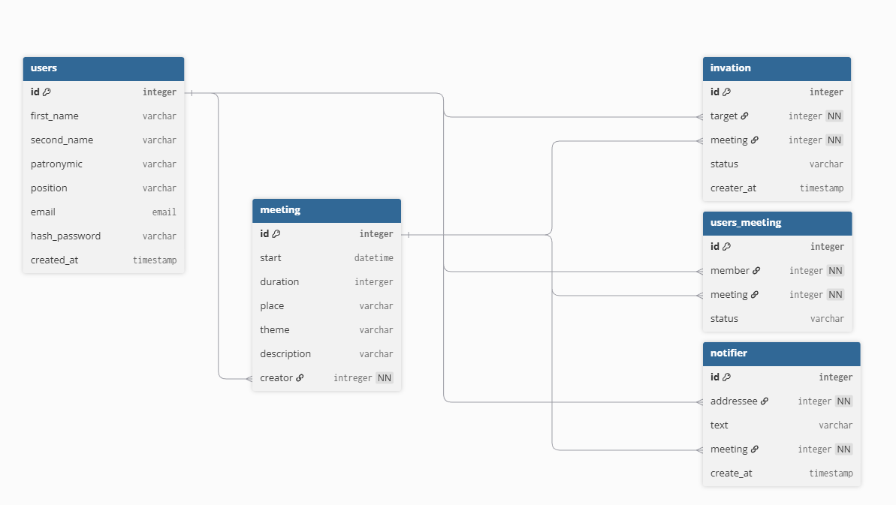

# Техническое задание на разработку программного продукта для планирования встреч

## Команда: ООПтимисты

## 1. Общие описание
Необходимо разработать программный продукт для планирования встреч сотрудников внутри компании. Система состоит из клиентского мобильного приложения и серверной части.

## 2. Клиентская часть (Android-приложение)
Клиентом является **Android-приложение**, которое должно быть реализовано на **Kotlin** или **Java** с использованием **адаптивной верстки**.

Приложение должно предоставлять интуитивно понятный интерфейс, в котором реализован следующий функционал:

*   **Регистрация и авторизация** сотрудника.
*   **Настройка личного профиля**.
*   **Создание встречи** с возможностью приглашения других сотрудников. Приглашенные сотрудники должны иметь возможность дать бинарный ответ (**принял** / **не принял**).
*   **Просмотр списка активных приглашений** на встречи с возможностью дать ответ о возможности посещения.
*   **Просмотр собственного расписания встреч** в разрезе дня, недели и месяца.

**Важное условие:** временные слоты для встреч разбиты строго по часам. Например, можно создать встречу на 9:00–10:00, но создание встречи на 9:10, 9:05 и т.д. — невозможно.

## 3. Серверная часть
Сервер представляет собой **микросервис на Spring Boot**, работающий с СУБД **PostgreSQL** или **H2**.

Серверное приложение должно:
*   Предоставлять API, необходимый для полноценной работы мобильного приложения.
*   Осуществлять все основные операции с данными в базе через **Spring Data JPA**.
*   Использовать **Liquibase** для создания схемы базы данных и ее предзаполнения.

## User Stories

### US1: Регистрация сотрудника
Как новый сотрудник, я хочу зарегистрироваться в системе, чтобы получить доступ к функционалу планирования встреч.

### US2: Авторизация сотрудника
Как зарегистрированный сотрудник, я хочу войти в систему, чтобы использовать приложение.

### US3: Управление профилем
Как сотрудник, я хочу редактировать свои личные данные (ФИО, должность, аватар), чтобы поддерживать актуальность информации.

### US4: Создание встречи
Как сотрудник, я хочу создавать встречи с выбором времени, участников и темы, чтобы организовать совещание.

### US5: Ответ на приглашение
Как сотрудник, я хочу видеть полученные приглашения и отвечать на них (принять/отклонить), чтобы подтвердить своё участие.

### US6: Просмотр расписания
Как сотрудник, я хочу видеть своё расписание в разных форматах (день/неделя/месяц), чтобы эффективно планировать время.

### US7: Просмотр истории уведомлений
Как сотрудник, я хочу видеть историю уведомлений, чтобы быстрее ориентироваться в хронологии встреч/ответов на приглашения и тд.

## Use Cases

### UC1: Регистрация сотрудника
1. Пользователь вводит email, пароль, ФИО.
2. Система проверяет уникальность email.
3. Система создаёт учётную запись.
4. Система отправляет подтверждение на email.

### UC2: Авторизация сотрудника
1. Пользователь вводит email и пароль.
2. Система проверяет данные.
3. Система создаёт токен доступа.
4. Пользователь получает доступ к приложению.

### UC3: Редактирование профиля
1. Пользователь открывает раздел профиля.
2. Пользователь изменяет данные.
3. Пользователь сохраняет изменения.
4. Система обновляет информацию в БД.

### UC4: Создание встречи
1. Пользователь выбирает дату и час начала.
2. Пользователь добавляет участников.
3. Пользователь указывает тему и описание.
4. Система проверяет доступность слотов у участников.
5. Система создаёт встречу и рассылает приглашения.

### UC5: Ответ на приглашение
1. Пользователь открывает список приглашений.
2. Пользователь выбирает приглашение.
3. Пользователь нажимает "Принять" или "Отклонить".
4. Система обновляет статус приглашения и уведомляет организатора.

### UC6: Просмотр расписания
1. Пользователь выбирает режим отображения (день/неделя/месяц).
2. Система загружает соответствующие встречи.
3. Пользователь видит своё расписание с возможностью детализации.

### UC7: Просмотр уведомлений
1. Нажать на кнопку с уведомлениями
2. Открывается модальное окно со списком разных уведомлений (Некий принял/отклонил приглашение, вас пригласили на встречу)
3. При нажатии на уведомления открывается встреча, к которой оно привязано

## Задачи для Backend-разработчика

### База данных и миграции
- [ ] Настроить PostgreSQL/H2
- [ ] Создать схемы БД через Liquibase
- [ ] Реализовать предзаполнение тестовыми данными

### Модели данных
- [ ] Создать сущность User (сотрудник)
- [ ] Создать сущность Meeting (встреча)
- [ ] Создать сущность Invitation (приглашение)
- [ ] Создать сущность Notifier (уведомление)
- [ ] Определить связи между сущностями

### API Endpoints
- [ ] Реализовать регистрацию (POST /api/register)
- [ ] Реализовать авторизацию (POST /api/login)
- [ ] Реализовать CRUD для профиля (GET/PUT /api/profile)
- [ ] Реализовать создание встречи (POST /api/meetings)
- [ ] Реализовать ответ на приглашение (PUT /api/invitations/{id})
- [ ] Реализовать получение расписания (GET /api/schedule)
- [ ] Реализовать получение уведомлений (GET /api/notifier)

### Бизнес-логика
- [ ] Реализовать проверку доступности слотов при создании встречи
- [ ] Реализовать отправку уведомлений о приглашениях
- [ ] Реализовать валидацию временных слотов

## ER диаграмма
